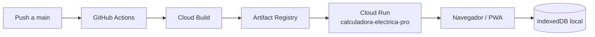

# Despliegue en GCP y Cloud Run

## Estado

Este documento fija el contrato de infraestructura para la primera versión desplegable. El proyecto aún está en fase de diseño; el servicio se creará cuando exista un contenedor web verificable.

Se revisó el repositorio privado `chrisloarryn/cloud-functions-scheduler`, rama `develop`, y específicamente su workflow `deploy-movil-app-backendo-dev.yml`. Se reutilizan el proyecto GCP, la región, la autenticación mediante GitHub Actions y el flujo Cloud Build → Cloud Run. Se asignan nombres propios para evitar colisiones con sus servicios.

## Topología inicial

Cloud Run entrega archivos estáticos. Los proyectos, cálculos e informes permanecen en el dispositivo y deben seguir funcionando offline.

## Configuración fijada

| Parámetro | Valor inicial |
|---|---|
| Proyecto GCP | `gcp-course-2024` |
| Región | `southamerica-west1` |
| Servicio Cloud Run | `calculadora-electrica-pro` |
| Repositorio Artifact Registry | `calculadora-electrica` |
| Imagen | `southamerica-west1-docker.pkg.dev/gcp-course-2024/calculadora-electrica/web` |
| Acceso | Público |
| Puerto | `PORT`, inyectado por Cloud Run |
| Memoria | `512Mi` |
| CPU | `1` |
| Timeout | `300s` |
| Mínimo de instancias | `0` |
| Máximo de instancias | `3` |

Container Registry dejó de aceptar escrituras el 18 de marzo de 2025. Aunque el repositorio de referencia usa `gcr.io`, este servicio nuevo utilizará Artifact Registry con dominio `pkg.dev`.

## Variables y secretos

### GitHub Actions Secrets

| Nombre | Estado | Uso |
|---|---|---|
| `GCP_SA_KEY` | Configurado | JSON de la cuenta de servicio de despliegue |
| `GCP_PROJECT_ID` | Configurado | Selección del proyecto `gcp-course-2024` |
| `GCP_REGION` | Configurado | Selección de `southamerica-west1` |

GitHub no permite volver a leer el valor de un secret. El archivo JSON fuente permanece fuera del repositorio y no debe copiarse a ninguna carpeta versionada.

### GitHub Actions Variables

| Nombre | Valor |
|---|---|
| `CLOUD_RUN_SERVICE` | `calculadora-electrica-pro` |
| `ARTIFACT_REGISTRY_REPOSITORY` | `calculadora-electrica` |
| `IMAGE_NAME` | `web` |
| `CLOUD_RUN_MEMORY` | `512Mi` |
| `CLOUD_RUN_CPU` | `1` |
| `CLOUD_RUN_TIMEOUT` | `300s` |

### Variables públicas del build

| Nombre | Ejemplo | Propósito |
|---|---|---|
| `VITE_APP_VERSION` | SHA de Git | Diagnóstico de la versión instalada |
| `VITE_ENGINE_VERSION` | `0.1.0` | Reproducibilidad del cálculo |
| `VITE_STANDARD_PROFILE_ID` | `CL-SEC-RIC` | Perfil normativo empaquetado |

Toda variable `VITE_*` es pública. Nunca debe contener tokens, claves, contraseñas ni información privada.

### Variables del repositorio de origen que no se heredan

`GCP_JOBS_REGION`, `RESUME_URL`, `GCP_SA_KEY_GMAIL`, `GOOGLE_APPLICATION_CREDENTIALS`, `GCP_IMAGE`, `NODE_ENV` y el `SERVICE_NAME` de otros componentes pertenecen a funciones o servicios distintos. No se añadirán al frontend solo por estar presentes en el repositorio de referencia.

## Preparación única de GCP

Antes del primer despliegue se deberá:

1. Habilitar Cloud Build, Cloud Run y Artifact Registry en `gcp-course-2024`.
2. Crear el repositorio Docker `calculadora-electrica` en `southamerica-west1` si no existe.
3. Verificar que la cuenta de servicio de GitHub pueda iniciar builds, escribir en ese repositorio y desplegar el servicio.
4. Verificar que Cloud Run pueda leer la imagen y que la identidad de ejecución no tenga permisos innecesarios.
5. Reemplazar a futuro la clave JSON por Workload Identity Federation para eliminar credenciales de larga duración.

## Contrato del contenedor web

- Build multi-stage: Node 22 o posterior compatible para compilar Vite; imagen mínima para servir `dist/`.
- Escuchar en `0.0.0.0:$PORT`; en local se usará `8080`.
- `GET /healthz` debe responder `200` sin dependencias externas.
- Las rutas de la SPA devuelven `index.html`; archivos inexistentes con extensión deben devolver `404`.
- `index.html`, `manifest.webmanifest` y el service worker deben revalidarse.
- Assets con hash deben responder con caché larga e `immutable`.
- El proceso debe aceptar `SIGTERM` y no escribir estado de usuario en disco.
- La revisión desplegada debe etiquetarse con el SHA de Git.

## Workflow previsto

El workflow se agregará junto con el scaffold ejecutable para que nunca exista un pipeline verde sin una aplicación verificable. En cada cambio desplegable deberá:

1. Ejecutar lint, typecheck, pruebas, casos dorados y build PWA.
2. Autenticarse con `GCP_SA_KEY` sin imprimir su contenido.
3. Construir una imagen etiquetada con `$GITHUB_SHA` mediante Cloud Build.
4. Publicarla en Artifact Registry.
5. Desplegar por digest o por etiqueta inmutable a `calculadora-electrica-pro`.
6. Esperar la URL de Cloud Run y ejecutar smoke tests de `/`, `/healthz`, manifest y service worker.
7. Conservar la revisión anterior para rollback.

## API futura en Go

La aplicación no necesita API en el MVP. Si aparecen cuentas, sincronización, licencias, colaboración o integraciones, se creará `calculadora-electrica-api` como servicio separado:

- Go 1.27, fijado a la última revisión de seguridad de la línea.
- Binario estático, contenedor mínimo y arranque rápido.
- HTTP/JSON como borde para el navegador.
- Protocol Buffers y gRPC nativo para comunicación entre servicios cuando exista más de uno.
- gRPC-Web solo si una prueba confirma beneficio y compatibilidad con la PWA; el navegador no consumirá gRPC nativo directamente.
- HTTP/2 extremo a extremo y servidor `h2c` al activar gRPC en Cloud Run.
- Deadlines, cancelación, límites de mensaje, health checks y métricas por método.
- Casos dorados idénticos entre el motor local TypeScript y cualquier implementación Go.

## Referencias técnicas

- [Transición desde Container Registry](https://docs.cloud.google.com/artifact-registry/docs/transition/transition-from-gcr)
- [Desplegar imágenes en Cloud Run](https://docs.cloud.google.com/run/docs/deploying)
- [Usar gRPC en Cloud Run](https://docs.cloud.google.com/run/docs/triggering/grpc)
- [HTTP/2 extremo a extremo en Cloud Run](https://docs.cloud.google.com/run/docs/configuring/http2)
- [Notas de Go 1.27](https://go.dev/doc/go1.27)
- [gRPC-Web para navegadores](https://grpc.io/docs/platforms/web/)
