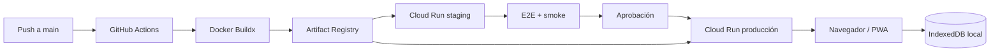

# Despliegue en GCP y Cloud Run

## Estado

Este documento fija el contrato de infraestructura para la primera versión desplegable. El contenedor web ya es verificable y el pipeline de staging realiza el bootstrap mínimo de forma idempotente.

Se revisó el repositorio privado `chrisloarryn/cloud-functions-scheduler`, rama `develop`, y específicamente su workflow `deploy-movil-app-backendo-dev.yml`. Se reutilizan el proyecto GCP, la región y la autenticación mediante GitHub Actions. Para esta aplicación, Docker Buildx construye en el runner de GitHub, publica en Artifact Registry y despliega Cloud Run sin usar Cloud Build.

## Topología inicial

Cloud Run entrega archivos estáticos. Los proyectos, cálculos e informes permanecen en el dispositivo y deben seguir funcionando offline.

## Configuración fijada

| Parámetro | Valor inicial |
|---|---|
| Proyecto GCP | `gcp-course-2024` |
| Región | `southamerica-west1` |
| Servicio Cloud Run staging | `calculadora-electrica-staging` |
| Servicio Cloud Run producción | `calculadora-electrica-pro` |
| Repositorio Artifact Registry | `calculadora-electrica` |
| Imagen | `southamerica-west1-docker.pkg.dev/gcp-course-2024/calculadora-electrica/web` |
| Acceso | Público |
| Puerto | `PORT`, inyectado por Cloud Run |
| Memoria | `512Mi` |
| CPU | `1` |
| Timeout | `300s` |
| Mínimo de instancias | `0` |
| Máximo de instancias | Staging `1`; producción `3` |

Container Registry dejó de aceptar escrituras el 18 de marzo de 2025. Aunque el repositorio de referencia usa `gcr.io`, este servicio nuevo utilizará Artifact Registry con dominio `pkg.dev`.

## Servicios GCP validados

Una consulta de solo lectura realizada el 23 de agosto de 2026 confirmó que estas APIs están habilitadas en `gcp-course-2024`:

- `cloudresourcemanager.googleapis.com`
- `iam.googleapis.com`
- `artifactregistry.googleapis.com`
- `run.googleapis.com`
- `logging.googleapis.com`
- `monitoring.googleapis.com`

`serviceusage.googleapis.com` está deshabilitada y no bloquea el pipeline porque las APIs requeridas ya están activas. Solo se habilitará si el bootstrap se automatiza.

Cloud Build y Cloud Storage no participan del pipeline. No se creará un bucket de la aplicación ni se guardarán proyectos eléctricos en GCP. Secret Manager, una base de datos, autenticación, mensajería, tareas, VPC y API Gateway quedan fuera del MVP. La justificación y los disparadores futuros están en la sección 21.4 del [SDD](SDD.md).

Los recursos `calculadora-electrica` de Artifact Registry, `calculadora-electrica-staging` y `calculadora-electrica-pro` de Cloud Run, y `calculadora-electrica-web@gcp-course-2024.iam.gserviceaccount.com` todavía no existen. Se crearán de forma idempotente junto con el primer contenedor verificable, no durante la fase documental.

## Variables y secretos

### GitHub Actions Secrets

| Nombre | Estado | Uso |
|---|---|---|
| `GCP_SA_KEY` | Configurado | JSON de la cuenta de servicio de despliegue |
| `GCP_PROJECT_ID` | Configurado | Selección del proyecto `gcp-course-2024` |
| `GCP_REGION` | Configurado | Selección de `southamerica-west1` |

GitHub no permite volver a leer el valor de un secret. El archivo JSON fuente permanece fuera del repositorio y no debe copiarse a ninguna carpeta versionada.

### GitHub Actions Variables

| Nombre | Valor |
|---|---|
| `CLOUD_RUN_STAGING_SERVICE` | `calculadora-electrica-staging` |
| `CLOUD_RUN_SERVICE` | `calculadora-electrica-pro` |
| `ARTIFACT_REGISTRY_REPOSITORY` | `calculadora-electrica` |
| `IMAGE_NAME` | `web` |
| `CLOUD_RUN_MEMORY` | `512Mi` |
| `CLOUD_RUN_CPU` | `1` |
| `CLOUD_RUN_TIMEOUT` | `300s` |
| `CLOUD_RUN_MIN_INSTANCES` | `0` |
| `CLOUD_RUN_STAGING_MAX_INSTANCES` | `1` |
| `CLOUD_RUN_MAX_INSTANCES` | `3` |

### Variables públicas del build

| Nombre | Ejemplo | Propósito |
|---|---|---|
| `VITE_APP_VERSION` | SHA de Git | Diagnóstico de la versión instalada |
| `VITE_ENGINE_VERSION` | `0.1.0` | Reproducibilidad del cálculo |
| `VITE_STANDARD_PROFILE_ID` | `CL-SEC-RIC` | Perfil normativo empaquetado |

Toda variable `VITE_*` es pública. Nunca debe contener tokens, claves, contraseñas ni información privada.

### Variables del repositorio de origen que no se heredan

`GCP_JOBS_REGION`, `RESUME_URL`, `GCP_SA_KEY_GMAIL`, `GOOGLE_APPLICATION_CREDENTIALS`, `GCP_IMAGE`, `NODE_ENV` y el `SERVICE_NAME` de otros componentes pertenecen a funciones o servicios distintos. No se añadirán al frontend solo por estar presentes en el repositorio de referencia.

## Preparación única de GCP

Antes del primer despliegue se deberá:

1. Revalidar que Cloud Run, Artifact Registry, Resource Manager, IAM, Logging y Monitoring continúen habilitados.
2. Crear el repositorio Docker `calculadora-electrica` en `southamerica-west1` si no existe.
3. Crear una cuenta runtime `calculadora-electrica-web` sin roles de proyecto.
4. Verificar que la cuenta de servicio de GitHub pueda escribir imágenes y desplegar el servicio, sin roles `Owner` ni `Editor`.
5. Verificar que Cloud Run pueda leer la imagen y que la identidad runtime no tenga permisos innecesarios.
6. Configurar un uptime check y alertas básicas de errores y latencia.
7. Reemplazar a futuro la clave JSON por Workload Identity Federation para eliminar credenciales de larga duración.

## Dominio propio

El piloto usará la URL HTTPS `run.app`. `southamerica-west1` no admite la asignación directa de dominios de Cloud Run, por lo que producción deberá usar un Global External Application Load Balancer con Serverless NEG y Certificate Manager cuando se defina un dominio. Cloud DNS, Cloud CDN y Cloud Armor seguirán siendo opcionales y no se crearán en el MVP.

## Contrato del contenedor web

- Build multi-stage: Node 24 para compilar Vite; imagen Nginx no-root para servir `dist/`.
- Escuchar en `0.0.0.0:$PORT`; en local se usará `8080`.
- `GET /healthz` debe responder `200` sin dependencias externas.
- Las rutas de la SPA devuelven `index.html`; archivos inexistentes con extensión deben devolver `404`.
- `index.html`, `manifest.webmanifest` y el service worker deben revalidarse.
- Assets con hash deben responder con caché larga e `immutable`.
- El proceso debe aceptar `SIGTERM` y no escribir estado de usuario en disco.
- La revisión desplegada debe etiquetarse con el SHA de Git.

## Workflow previsto

Los workflows se agregarán junto con el scaffold ejecutable para que nunca exista un pipeline verde sin una aplicación verificable:

1. `ci.yml` valida cada PR sin secrets: lint, typecheck, motor, casos dorados, PWA, E2E, contenedor y supply chain.
2. `deploy-staging.yml` espera el `ci-gate` verde de `main`, construye una sola imagen con Docker Buildx, la publica con SBOM/provenance y la despliega por digest a `calculadora-electrica-staging`.
3. `release-production.yml` toma ese mismo digest, espera aprobación, crea una revisión sin tráfico, prueba su URL etiquetada y luego mueve 100% del tráfico.
4. `rollback-production.yml` devuelve tráfico a una revisión conocida sin reconstruir.

No se dividirá tráfico porcentualmente entre revisiones del frontend porque una respuesta HTML podría referenciar assets con hash ausentes en la otra revisión. Todos los detalles, gates, permisos, concurrencia y criterios están en la sección 21.3 del [SDD](SDD.md).

## API futura en Go

La aplicación no necesita API en el MVP. Si aparecen cuentas, sincronización, licencias, colaboración o integraciones, se creará `calculadora-electrica-api` como servicio separado:

- Go 1.27, fijado a la última revisión de seguridad de la línea.
- Binario estático, contenedor mínimo y arranque rápido.
- HTTP/JSON como borde para el navegador.
- Protocol Buffers y gRPC nativo para comunicación entre servicios cuando exista más de uno.
- gRPC-Web solo si una prueba confirma beneficio y compatibilidad con la PWA; el navegador no consumirá gRPC nativo directamente.
- HTTP/2 extremo a extremo y servidor `h2c` al activar gRPC en Cloud Run.
- Deadlines, cancelación, límites de mensaje, health checks y métricas por método.
- Casos dorados idénticos entre el motor local TypeScript y cualquier implementación Go.

## Referencias técnicas

- [Transición desde Container Registry](https://docs.cloud.google.com/artifact-registry/docs/transition/transition-from-gcr)
- [Desplegar imágenes en Cloud Run](https://docs.cloud.google.com/run/docs/deploying)
- [Autenticarse en GCP desde GitHub Actions](https://github.com/google-github-actions/auth)
- [Rollouts y rollback en Cloud Run](https://docs.cloud.google.com/run/docs/rollouts-rollbacks-traffic-migration)
- [Logs de Cloud Run](https://docs.cloud.google.com/run/docs/logging)
- [Monitoreo de Cloud Run](https://docs.cloud.google.com/run/docs/monitoring)
- [Dominios personalizados de Cloud Run](https://docs.cloud.google.com/run/docs/mapping-custom-domains)
- [Regiones disponibles de Cloud Run](https://cloud.google.com/run/docs/locations)
- [GitHub Actions Environments](https://docs.github.com/en/actions/reference/workflows-and-actions/deployments-and-environments)
- [Protección de ramas en GitHub](https://docs.github.com/en/repositories/configuring-branches-and-merges-in-your-repository/managing-protected-branches/about-protected-branches)
- [OIDC de GitHub con GCP](https://docs.github.com/en/actions/how-tos/secure-your-work/security-harden-deployments/oidc-in-google-cloud-platform)
- [Usar gRPC en Cloud Run](https://docs.cloud.google.com/run/docs/triggering/grpc)
- [HTTP/2 extremo a extremo en Cloud Run](https://docs.cloud.google.com/run/docs/configuring/http2)
- [Notas de Go 1.27](https://go.dev/doc/go1.27)
- [gRPC-Web para navegadores](https://grpc.io/docs/platforms/web/)
