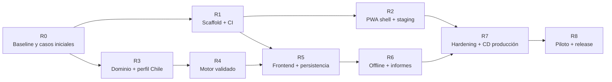

# Ruta de implementación — Calculadora Eléctrica Pro

| Campo | Valor |
|---|---|
| Estado | Ruta propuesta para ejecución |
| Versión | 1.1.0 |
| Fecha base | 23 de agosto de 2026 |
| Arquitectura de referencia | [SDD 0.5.0](SDD.md) |
| Rama principal | `main` |
| Entrega inicial | PWA mobile-first en Cloud Run |

## 1. Propósito

Este documento transforma el SDD en una secuencia ejecutable. Define qué construir primero, qué puede avanzar en paralelo, qué evidencia debe producir cada hito y cuándo se habilitan CI, staging y producción.

La ruta busca obtener pronto una vertical funcional sin presentar cálculos como validados antes de tiempo. Plataforma, interfaz y PWA pueden avanzar con contratos y fixtures; ningún resultado eléctrico pasa a piloto hasta aprobar el perfil normativo y los casos dorados.

## 2. Principios de ejecución

1. `main` debe permanecer desplegable.
2. CI se implementa antes del motor y de la interfaz funcional.
3. Se despliega una app shell a staging antes de incorporar reglas eléctricas.
4. El motor se desarrolla fuera de React, DOM, IndexedDB y red.
5. UI y motor se conectan por contratos tipados y snapshots.
6. Cada regla eléctrica nace con pruebas, explicación y fuente.
7. La misma imagen aprobada en staging se promueve por digest a producción.
8. No se habilitan servicios GCP ni dependencias “por si acaso”.
9. Una fase termina por evidencia, no porque se agotó el tiempo estimado.

### 2.1 Estado actual

| Área | Estado al 23 de agosto de 2026 |
|---|---|
| Producto y arquitectura | SDD, motor inicial, análisis y CI/CD definidos |
| GitHub | Repositorio, secrets y variables GCP configurados |
| Código web | No iniciado |
| Workflows y protección de `main` | Pendientes hasta que exista `ci-gate` real |
| GCP | APIs necesarias habilitadas; repositorio y servicios aún no creados |
| Ruta activa | R0, seguida por PR-001 y PR-002 |

## 3. Ruta crítica

La ruta normativa `R0 → R3 → R4` y la ruta de plataforma `R1 → R2` pueden avanzar en paralelo después de fijar los contratos iniciales. `R5` es el punto de integración: requiere un motor estable y un frontend probado. `R7` no comienza hasta que staging y el flujo funcional completo estén verdes.

## 4. Frentes de trabajo

| Frente | Responsabilidad | Entregables principales |
|---|---|---|
| Plataforma | Repositorio, toolchain, CI/CD y GCP | Scripts, workflows, contenedor, staging, release y rollback |
| Dominio | Modelo, unidades, normativa y motor | Esquemas, perfil Chile, resultados explicables y casos dorados |
| Producto | Diseño mobile-first y flujos | Proyectos, circuitos, cargas, resultados y accesibilidad |
| PWA y documentos | Persistencia, offline e informes | IndexedDB, service worker, PDF, SVG y JSON |
| Calidad y validación | Riesgo técnico y evidencia | Fixtures, E2E, seguridad, rendimiento, revisión eléctrica y piloto |

Una persona puede ejecutar los frentes secuencialmente. Con más capacidad, Plataforma y Dominio son las dos primeras líneas paralelas; Producto puede construir componentes contra mocks, pero no cerrar integración sin `R4`.

## 5. Hitos y gates

| Hito | Resultado | Depende de | Gate de salida |
|---|---|---|---|
| R0 | Baseline aceptada | SDD | Alcance, contratos y cinco casos iniciales definidos |
| R1 | Proyecto ejecutable con CI | R0 | `ci-gate` verde sobre app mínima |
| R2 | PWA shell desplegada a staging | R1 | HTTPS, manifest, health y smoke tests verdes |
| R3 | Dominio y perfil Chile versionado | R0 | Esquemas y tablas con fuente y revisión inicial |
| R4 | Motor determinista validado | R3 | Casos dorados e invariantes aprobados |
| R5 | ✅ Completado | R1, R4 | Caso de cuatro circuitos guardado y reabierto. Evidencia: commit `f613377`; CI runs: 32624162197 (build), staging deploy 32624000099; validación local: imagen `calculadora-local:testing`, `/health` respondió 200. |
| R6 | Offline e informes completos | R5 | Flujo P0, PDF, SVG y JSON funcionan sin red |
| R7 | Release candidate endurecida | R2, R6 | Seguridad, accesibilidad, performance y rollback aprobados |
| R8 | Piloto y producción | R7 | Revisión profesional y checklist de salida firmados |

## 6. Detalle por hito

### R0 — Baseline y preparación

Objetivo: eliminar decisiones que invalidarían el modelo o el pipeline.

Trabajo:

- Confirmar Chile como perfil inicial o registrar formalmente la excepción.
- Nombrar responsable de producto y revisor técnico eléctrico.
- Aceptar ADR-001 a ADR-009.
- Definir unidades canónicas, precisión y política de redondeo.
- Crear cinco casos dorados iniciales y el formato para llegar a 15–25.
- Fijar soporte mínimo de navegadores y dispositivos.
- Aprobar los contratos `Project`, `Circuit`, `Load`, `StandardProfile` y `CalculationSnapshot`.
- Crear labels de backlog: `platform`, `domain`, `frontend`, `pwa`, `reports`, `quality`, `infra`, `blocked`.

Salida:

- No quedan decisiones abiertas que cambien el esqueleto del repositorio.
- Los pendientes normativos tienen responsable y no se presentan como validados.

### R1 — Scaffold y CI sin secretos

Objetivo: lograr feedback automático antes de implementar funcionalidad.

Trabajo:

- Crear React + TypeScript estricto + Vite.
- Fijar versión de Node y package manager; versionar lockfile.
- Configurar lint, formato, typecheck, Vitest y Playwright.
- Crear la estructura de carpetas definida por el SDD.
- Aplicar Atomic Design (`atoms`, `molecules`, `organisms`, `templates`, `pages`) y mantener `App` como compositor mínimo.
- Añadir scripts `dev`, `build`, `lint`, `typecheck`, `test`, `test:e2e` y `ci`.
- Crear `ci.yml` con jobs `quality`, `engine-tests`, `ui-tests`, `pwa-e2e`, `build`, `container`, `supply-chain` y `ci-gate`.
- Añadir fixtures sintéticos; nunca datos reales.
- Configurar Dependabot o actualización equivalente de Actions y npm.
- Después del primer `ci-gate` verde, proteger `main` y exigir PR.

Salida:

- Clonar, instalar y ejecutar CI localmente funciona con instrucciones reproducibles.
- Un error de lint, tipos, tests o build bloquea el merge.
- PRs y forks no pueden leer secretos GCP.

### R2 — PWA shell, contenedor y staging

Objetivo: validar pronto la cadena navegador → contenedor → GCP.

Trabajo:

- Crear layout mobile-first, router, tokens y páginas placeholder.
- Construir el shell con componentes accesibles y reutilizables; probar sus contratos por composición.
- Incorporar manifest, iconos iniciales y service worker de app shell.
- Añadir página offline y flujo explícito de actualización.
- Crear Dockerfile multi-stage y servidor estático no root.
- Configurar `/health`, fallback SPA, CSP y caché correcta.
- Crear de forma idempotente:
  - Artifact Registry `calculadora-electrica`.
  - Cuenta runtime `calculadora-electrica-web` sin roles de proyecto.
  - Cloud Run `calculadora-electrica-staging` con mínimo 0 y máximo 1.
- Crear GitHub Environment `staging`.
- Mover `GCP_SA_KEY` fuera del scope de PR y añadir `deploy-staging.yml`.
- Construir por SHA, resolver digest y ejecutar smoke/E2E HTTPS.

Salida:

- Cada merge desplegable a `main` publica automáticamente una app shell verificable en staging.
- Un commit documental no construye imágenes ni despliega Cloud Run.
- La PWA puede instalarse y abrir el shell offline tras la primera visita.

### R3 — Dominio y perfil normativo Chile

Objetivo: modelar entradas y reglas sin acoplarlas a la UI.

Trabajo:

- Implementar value objects para potencia, corriente, tensión, longitud, sección y porcentaje.
- Implementar esquemas y migración inicial del proyecto.
- Definir estados `incomplete`, `blocked`, `warning` y `valid`.
- Crear `CL-SEC-RIC` versionado con fuentes, fecha y responsable.
- Cargar calibres/secciones, materiales, métodos de instalación y límites incluidos.
- Separar datos normativos de algoritmos generales.
- Añadir validadores de integridad y tests de tablas.
- Aumentar los casos dorados con revisión profesional.

Salida:

- Ninguna tabla carece de fuente o versión.
- Importar un perfil inválido falla de forma controlada.
- El dominio se prueba sin navegador.

### R4 — Motor de cálculo

Objetivo: convertir entradas validadas en resultados trazables.

Orden interno:

1. Corriente monofásica y trifásica.
2. Cantidad, demanda y simultaneidad.
3. Factor de potencia y rendimiento.
4. Capacidad corregida por instalación, temperatura y agrupamiento.
5. Caída de tensión y búsqueda de sección.
6. Resolución conjunta conductor–breaker.
7. Diferencial y advertencias incluidas en el perfil.
8. Explicaciones, reglas aplicadas y `CalculationSnapshot`.

Pruebas:

- Unitarias por fórmula.
- Propiedades e invariantes.
- Límites inferior/superior y datos incompletos.
- Casos dorados monofásicos, trifásicos y condiciones gobernantes distintas.
- Determinismo y serialización estable.

Salida:

- Todos los casos dorados aprobados.
- Ninguna recomendación viola las invariantes del SDD.
- El mismo input y versiones producen el mismo snapshot.

### R5 — Frontend mobile-first y persistencia

Objetivo: completar la vertical principal desde un teléfono.

Trabajo:

- Lista, creación, renombrado, duplicado y eliminación de proyectos.
- Selector y CRUD de circuitos.
- Editor de cargas con cantidad, potencia, tipo y factores.
- Modo básico y avanzado.
- Resultado en vivo con debounce controlado.
- Explicaciones, fuentes, advertencias y bloqueos.
- Componentes táctiles accesibles y alternativa móvil para tablas.
- Repositorios IndexedDB, autosave, recuperación y migraciones.
- Exportación/importación JSON preliminar.
- Deshacer para acciones destructivas locales.

Salida:

- El escenario de cuatro circuitos se completa en móvil.
- Cerrar y reabrir conserva el proyecto.
- UI y motor consumen el mismo contrato, sin duplicar fórmulas.

### R6 — PWA offline e informes

Objetivo: cerrar el valor profesional y la operación en terreno.

Trabajo:

- Precache de app shell, fuentes, iconos y perfil normativo.
- Pruebas offline reales después de primera carga.
- Actualización controlada sin perder ediciones.
- Compatibilidad de IndexedDB `N-1 → N` y recuperación.
- Snapshot inmutable de informe.
- PDF con resumen, circuitos, cargas, reglas, versiones y advertencias.
- Unifilar SVG básico generado desde el modelo.
- Exportación e importación JSON completas.
- Pruebas visuales y de paginación para proyectos pequeños/grandes.

Salida:

- Crear, calcular, guardar, exportar y generar PDF funciona sin red.
- PDF y UI coinciden para el mismo snapshot.
- Actualizar o recuperar no pierde datos.

### R7 — Hardening y CD de producción

Objetivo: producir una release candidate operable y reversible.

Trabajo:

- Auditoría de accesibilidad WCAG 2.2 AA en flujos críticos.
- Performance móvil, presupuesto de bundle y tiempos del motor/PDF.
- Escaneo de dependencias, contenedor, secrets y SBOM.
- Revisar CSP, headers, cache, 404 y service worker.
- Crear GitHub Environment `production` con protección.
- Crear Cloud Run `calculadora-electrica-pro` con mínimo 0 y máximo 3.
- Crear `release-production.yml` por digest y revisión sin tráfico.
- Crear `rollback-production.yml` y ensayarlo.
- Configurar uptime check, alertas y presupuesto.
- Migrar a WIF si es viable; de lo contrario documentar rotación de la clave.

Salida:

- La misma imagen probada en staging llega a producción.
- Smoke tests fallidos restauran la revisión previa.
- El rollback y la compatibilidad PWA/IndexedDB están ensayados.

### R8 — Piloto y release

Objetivo: validar con usuarios reales antes de declarar producción estable.

Trabajo:

- Completar 15–25 casos dorados aprobados.
- Revisión eléctrica profesional de reglas, resultados, explicaciones y PDF.
- Pruebas en la matriz de teléfonos y navegadores.
- Piloto controlado con proyectos no críticos o duplicados de verificación.
- Canal para reportar cálculos dudosos y procedimiento de triage.
- Política de privacidad, descargos y documentación de usuario.
- Resolver defectos críticos y altos.
- Crear tag semántico y promover el digest aprobado.

Salida:

- Cero defectos críticos abiertos.
- Aprobación técnica registrada.
- Release, digest, perfil normativo, motor y esquema quedan trazables.

## 7. Secuencia propuesta de PRs

| PR | Rama sugerida | Alcance | Depende de |
|---|---|---|---|
| 001 | `chore/bootstrap-web` | Vite, TypeScript, scripts y estructura | R0 |
| 002 | `ci/quality-gates` | Tests base, Playwright y `ci.yml` | PR-001 |
| 003 | `feat/pwa-shell` | Layout, manifest, offline shell y actualización | PR-002 |
| 004 | `infra/cloud-run-staging` | Docker, GCP bootstrap y staging CD | PR-003 |
| 005 | `feat/domain-model` | Entidades, unidades, schemas y estados | PR-002 |
| 006 | `feat/standards-chile` | Perfil versionado, tablas y validadores | PR-005 |
| 007 | `feat/calculation-core` | Corriente, demanda y factores | PR-006 |
| 008 | `feat/conductor-protection` | Capacidad, caída, conductor, breaker y diferencial | PR-007 |
| 009 | `feat/local-storage` | IndexedDB, autosave, migraciones y JSON base | PR-005 |
| 010 | `feat/project-circuit-ui` | Proyectos, circuitos y cargas mobile-first | PR-003, PR-008, PR-009 |
| 011 | `feat/results-explanations` | Resultados, estados, fuentes y trazabilidad | PR-008, PR-010 |
| 012 | `feat/offline-lifecycle` | Offline completo, actualización y recuperación | PR-010 |
| 013 | `feat/reports-export` | Snapshot, PDF, unifilar y JSON completo | PR-011, PR-012 |
| 014 | `test/release-hardening` | Accesibilidad, performance, seguridad y compatibilidad | PR-013 |
| 015 | `infra/production-release` | Production environment, promoción y rollback | PR-004, PR-014 |
| 016 | `release/pilot` | Evidencia, correcciones y primera release | PR-015 |

PR-004 puede avanzar en paralelo con PR-005 a PR-008. PR-009 puede avanzar en paralelo con el motor una vez congelados los esquemas de PR-005. PR-010 no se integra hasta que motor y persistencia tengan contratos estables.

## 8. Estrategia de ramas y releases

- No se mantendrá una rama `develop` de larga duración.
- Cada cambio parte desde `main` actualizado y utiliza `feat/`, `fix/`, `test/`, `infra/`, `docs/` o `chore/`.
- Cada PR debe corresponder a un objetivo verificable y declarar requisitos SDD afectados.
- `main` despliega staging solo cuando cambian archivos ejecutables o de infraestructura.
- Producción promueve un digest aprobado; no construye nuevamente.
- Tags `vMAJOR.MINOR.PATCH` identifican releases, no imágenes mutables.
- Hotfix sigue PR y CI; si la urgencia impide esperar una feature normal, nunca elimina los casos dorados ni la prueba de staging.

## 9. Definition of Ready de un PR

Antes de comenzar:

- Objetivo y no-objetivos claros.
- Requisitos funcionales/no funcionales identificados.
- Contratos o esquemas afectados conocidos.
- Criterios de aceptación verificables.
- Fixtures disponibles o plan para crearlos.
- Riesgo normativo, de datos y de despliegue clasificado.
- Dependencias previas integradas.

## 10. Definition of Done de un PR

- Código y documentación coherentes con SDD.
- Tests nuevos y existentes verdes.
- Sin fórmulas eléctricas duplicadas en UI o PDF.
- Accesibilidad y comportamiento móvil revisados si cambia UI.
- Migración y compatibilidad probadas si cambia persistencia.
- Sin secrets, datos reales ni nuevas APIs GCP innecesarias.
- `ci-gate` verde.
- Evidencia de staging cuando corresponda.
- Observaciones y deuda explícita registradas; no ocultas en comentarios temporales.

## 11. Controles de alcance

En el MVP no se implementan:

- Backend, cuentas o sincronización.
- Base de datos o almacenamiento de proyectos en GCP.
- Colaboración, suscripciones o pagos.
- API Gateway, colas, jobs o funciones.
- Módulos eléctricos especiales excluidos por el SDD.
- gRPC mientras no exista más de un servicio que lo justifique.

Una solicitud que agregue cualquiera de estos elementos requiere ADR y replanificación antes de entrar al backlog.

## 12. Estimación y capacidad

Para una persona desarrolladora con revisión eléctrica periódica, el MVP pilotable sigue una banda aproximada de 6–10 semanas. No es un compromiso de fecha; la mayor incertidumbre es la validación normativa y los casos dorados.

| Bloque | Banda orientativa |
|---|---:|
| R0–R2 plataforma y staging | 1–2 semanas |
| R3–R4 dominio y motor | 2–3 semanas |
| R5–R6 frontend, offline e informes | 2–3 semanas |
| R7–R8 hardening, piloto y release | 1–2 semanas |

Con dos personas, Plataforma y Dominio pueden avanzar en paralelo. Agregar más personas al motor sin un revisor y contratos estables aumenta el riesgo en vez de reducir la ruta crítica.

## 13. Riesgos de ejecución

| Riesgo | Señal temprana | Respuesta |
|---|---|---|
| Perfil normativo no validado | Fixtures discutidos o fuentes incompletas | Mantener UI en estado no validado y priorizar revisión |
| CI lento o inestable | Más de 10 minutos o reintentos frecuentes | Separar suites, medir y corregir flakes antes de sumar features |
| Acoplamiento UI–motor | Fórmulas o reglas en componentes | Bloquear PR y mover lógica al motor/perfil |
| Migración local irreversible | Fixture `N-1` deja de abrir | Detener release y añadir recuperación/exportación |
| Divergencia staging–producción | Se reconstruye en release | Promover solo por digest |
| Scope creep | Aparecen cuentas, precios o backend | Registrar ADR y mover fuera del MVP |
| Revisión tardía | Motor completo sin casos aprobados | Incorporar al revisor desde R0/R3 |

## 14. Próximo movimiento

La ejecución comienza con R0 y PR-001. En paralelo se deben preparar los cinco casos dorados iniciales y asignar el revisor técnico. PR-002 instala CI inmediatamente después del scaffold; ninguna feature funcional debe adelantarse a ese gate.
