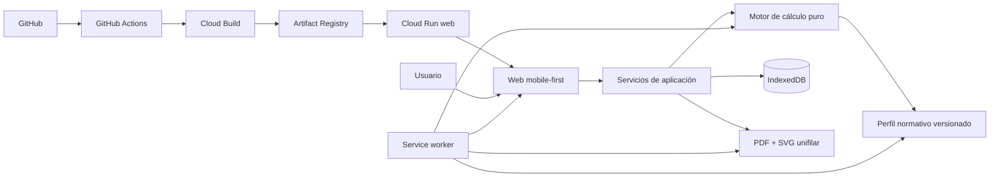
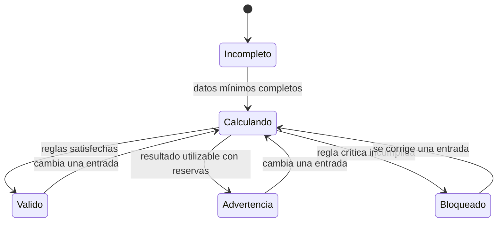
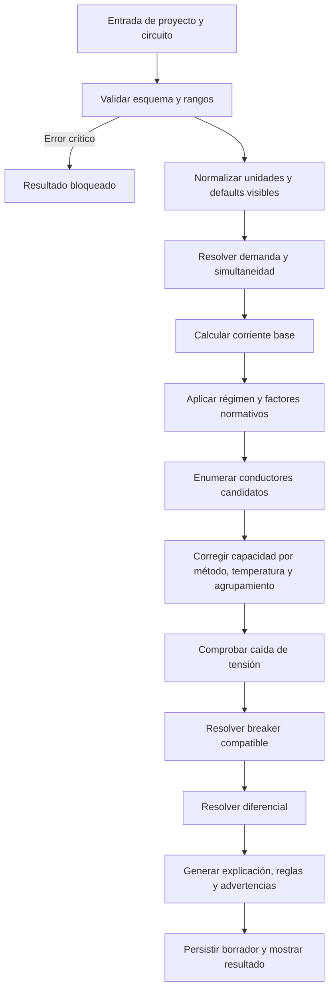

# Software Design Document — Calculadora Eléctrica Pro

| Campo | Valor |
|---|---|
| Estado | Propuesto para implementación |
| Versión | 0.3.0 |
| Fecha | 23 de agosto de 2026 |
| Producto | Calculadora Eléctrica Pro |
| Plataforma | Aplicación web mobile-first instalable como PWA |
| Mercado normativo inicial | Chile, sujeto a validación profesional |
| Proyecto GCP | `gcp-course-2024` |
| Hosting inicial | Cloud Run, región `southamerica-west1` |

## 1. Propósito

Este documento define cómo construir una calculadora eléctrica web con paridad funcional respecto de las referencias analizadas, manteniendo una implementación, identidad visual y código propios.

El producto permitirá convertir cargas eléctricas en circuitos dimensionados y documentados. La experiencia debe ser suficientemente rápida para uso en terreno, pero cada resultado deberá conservar la trazabilidad necesaria para que pueda ser revisado por un profesional.

Este SDD es la fuente principal para las decisiones de arquitectura. Los documentos de análisis y del motor de cálculo aportan contexto y detalle normativo:

- [Análisis de las referencias](ANALISIS_REFERENCIA.md)
- [Especificación inicial del motor](MOTOR_DE_CALCULO.md)
- [Plan de implementación](PLAN_IMPLEMENTACION.md)

## 2. Resumen de la solución

La solución será una aplicación web responsive diseñada primero para teléfonos. Podrá abrirse desde una URL o instalarse como PWA, tendrá apariencia de aplicación independiente y seguirá operando sin conexión después de su primera carga completa.

El MVP no requerirá una API. El motor de cálculo, las tablas normativas, el almacenamiento de proyectos y la generación de informes funcionarán en el dispositivo del usuario. Cloud Run se utilizará inicialmente como host del contenedor que entrega los archivos estáticos de la PWA; no recibirá ni almacenará proyectos eléctricos.



## 3. Objetivos

### 3.1 Objetivos del producto

- Reducir el tiempo entre el levantamiento de cargas y un cálculo documentado.
- Permitir proyectos con varios circuitos y varias cargas por circuito.
- Recomendar conductor, protección termomagnética y diferencial.
- Comprobar y explicar la caída de tensión.
- Generar un informe PDF profesional y un diagrama unifilar básico.
- Funcionar desde el navegador, instalada como PWA o sin conexión.
- Mantener reproducibilidad mediante perfiles normativos e informes versionados.

### 3.2 Objetivos de ingeniería

- Separar por completo cálculo, normativa, interfaz, persistencia e informes.
- Mantener el motor determinista y ejecutable sin navegador.
- Impedir que una actualización normativa altere silenciosamente informes anteriores.
- Probar las reglas críticas mediante casos dorados revisados por un profesional.
- Evitar un backend hasta que sincronización, cuentas o cobros lo justifiquen.

### 3.3 No objetivos del MVP

- No sustituir la revisión, medición, firma o declaración de un instalador autorizado.
- No certificar legalmente una instalación.
- No calcular cortocircuito o selectividad completa sin parámetros de red.
- No diseñar en detalle puesta a tierra.
- No cubrir ambientes explosivos, autogeneración, baterías ni electromovilidad.
- No incluir colaboración en tiempo real, pagos ni precios dinámicos.
- No distribuir inicialmente una aplicación nativa mediante tiendas móviles.

## 4. Paridad funcional con la referencia

### 4.1 Capacidades que se replicarán

| Área | Comportamiento observado | Implementación propia requerida |
|---|---|---|
| Circuitos | Pestañas con nombre y resultado resumido | Selector móvil con crear, renombrar, duplicar y eliminar |
| Configuración | Voltaje, demanda, seguridad, curva y distancia | Modo básico más modo avanzado con condiciones reales de instalación |
| Cargas | Varias filas con artefacto, potencia y cantidad | Catálogo tipado más entrada personalizada |
| Resultados | Corriente, breaker, cable, caída y diferencial | Resultado explicable con reglas, supuestos y advertencias |
| Actualización | Recálculo inmediato al editar | Pipeline determinista con debounce solo para la interfaz |
| PDF | Resumen de varios circuitos y unifilar | Instantánea inmutable usada por pantalla y PDF |
| Uso en teléfono | Flujo vertical de tarjetas | Diseño mobile-first con controles táctiles accesibles |

### 4.2 Mejoras obligatorias respecto de la referencia

- No inferir el tipo de carga desde un nombre de texto libre.
- No tratar mm² y AWG como equivalencias exactas.
- No recomendar una curva de breaker sin conocer el tipo de carga.
- No recomendar un diferencial universal para todos los casos.
- No ocultar los factores de corrección aplicados.
- No mostrar un resultado como válido cuando faltan datos críticos.
- No mezclar reglas normativas con componentes visuales.

### 4.3 Elementos que no se copiarán

- Nombre comercial, logotipo, textos de venta o identidad de la referencia.
- Código, recursos gráficos, iconos, estilos o plantillas de informe.
- Flujos de compra, precios o limitaciones de la versión demo.

La paridad será funcional, no una reproducción visual ni de marca.

## 5. Actores y casos de uso

### 5.1 Actores

| Actor | Necesidad principal |
|---|---|
| Técnico o instalador | Dimensionar y documentar circuitos rápidamente |
| Revisor técnico | Auditar entradas, reglas, supuestos y resultados |
| Propietario del proyecto | Recibir un informe comprensible |
| Administrador futuro | Publicar perfiles normativos y catálogos validados |

### 5.2 Flujo principal

1. El usuario abre o instala la PWA.
2. Crea un proyecto y selecciona el perfil normativo.
3. Define el suministro general.
4. Crea un circuito desde cero o desde una plantilla.
5. Registra condiciones de instalación y cargas.
6. El sistema valida y calcula en el dispositivo.
7. El usuario revisa resultados, explicaciones y advertencias.
8. Repite el proceso para los demás circuitos.
9. Revisa el resumen del tablero.
10. Crea una instantánea y exporta el PDF.

### 5.3 Estados del cálculo



## 6. Requisitos funcionales

| ID | Requisito | Prioridad |
|---|---|---|
| FR-001 | Crear, renombrar, duplicar, archivar y eliminar proyectos | P0 |
| FR-002 | Crear, ordenar, duplicar, renombrar y eliminar circuitos | P0 |
| FR-003 | Agregar, editar, duplicar y eliminar cargas | P0 |
| FR-004 | Manejar potencia, cantidad, tipo, factor de potencia y rendimiento | P0 |
| FR-005 | Ofrecer configuración básica y avanzada por circuito | P0 |
| FR-006 | Calcular potencia instalada, potencia demandada y corriente de diseño | P0 |
| FR-007 | Seleccionar conductor por sección mínima, capacidad corregida y caída | P0 |
| FR-008 | Recomendar breaker, curva y polos cuando haya datos suficientes | P0 |
| FR-009 | Recomendar diferencial con sensibilidad, clase y corriente nominal | P0 |
| FR-010 | Mostrar fórmula, reglas, supuestos y advertencias del cálculo | P0 |
| FR-011 | Guardar automáticamente todos los cambios en el dispositivo | P0 |
| FR-012 | Reabrir y editar proyectos sin conexión | P0 |
| FR-013 | Generar PDF y diagrama unifilar sin conexión | P0 |
| FR-014 | Instalar la aplicación como PWA en navegadores compatibles | P0 |
| FR-015 | Exportar e importar un proyecto como JSON versionado | P1 |
| FR-016 | Ofrecer plantillas para iluminación, enchufes, motores y alto consumo | P1 |
| FR-017 | Comparar alternativas de conductor y protección | P1 |
| FR-018 | Recalcular un proyecto con una versión normativa nueva sin sobrescribir el anterior | P1 |

## 7. Requisitos no funcionales

| ID | Requisito | Objetivo verificable |
|---|---|---|
| NFR-001 | Plataforma | Una sola aplicación web para teléfono, tablet y escritorio |
| NFR-002 | PWA | Manifest, service worker, iconos y modo standalone válidos |
| NFR-003 | Offline | Flujo completo disponible después de la primera carga |
| NFR-004 | Rendimiento | Recálculo de un circuito típico en menos de 100 ms en el dispositivo de prueba |
| NFR-005 | Determinismo | Entradas y versión iguales producen exactamente la misma salida |
| NFR-006 | Reproducibilidad | Todo informe incluye versiones de esquema, motor y perfil |
| NFR-007 | Accesibilidad | Objetivo WCAG 2.2 AA para flujos críticos |
| NFR-008 | Privacidad | Ningún proyecto sale del dispositivo en el MVP |
| NFR-009 | Resiliencia | Recuperación segura ante cierre, actualización o cuota insuficiente |
| NFR-010 | Mantenibilidad | Cobertura completa de reglas críticas y dependencias unidireccionales |
| NFR-011 | Compatibilidad | Navegadores evergreen con degradación clara si no permiten instalación |
| NFR-012 | Localización | Unidades y textos desacoplados para añadir países e idiomas |

## 8. Decisiones de arquitectura

### ADR-001 — Aplicación web PWA, no aplicación nativa

Se utilizará una base de código web responsive. La instalación se ofrecerá mediante capacidades PWA del navegador. Esto mantiene acceso por URL, actualización centralizada y operación offline sin mantener proyectos nativos separados.

### ADR-002 — MVP local-first y sin backend

Los proyectos residirán en IndexedDB. El cálculo y los informes se ejecutarán localmente. El sistema no dependerá de autenticación ni disponibilidad de red.

### ADR-003 — Motor TypeScript puro

El motor aceptará objetos validados y devolverá objetos de resultado. No accederá a React, DOM, IndexedDB, reloj del sistema, red ni variables globales.

### ADR-004 — Normativa como datos versionados

Las tablas y reglas específicas de cada jurisdicción vivirán en perfiles versionados. El motor general no contendrá condicionales dispersos por país.

### ADR-005 — PDF desde una instantánea inmutable

La pantalla y el PDF consumirán el mismo `CalculationSnapshot`. El PDF nunca recalculará por su cuenta.

### ADR-006 — Actualizaciones explícitas

Una nueva versión de la PWA no modificará el proyecto mientras esté abierto. El usuario recibirá una indicación para recargar; los informes históricos conservarán su versión original.

### ADR-007 — Cloud Run como hosting inicial

Se reutilizará el proyecto GCP `gcp-course-2024`, pero se crearán recursos separados para esta aplicación. El servicio web será `calculadora-electrica-pro` en `southamerica-west1`, público y sin autenticación. Su contenedor servirá la SPA/PWA por el puerto indicado en `PORT`.

Las imágenes nuevas se almacenarán en Artifact Registry. No se copiará la ruta `gcr.io` del repositorio de referencia porque Container Registry dejó de aceptar escrituras; se conservarán el proyecto, la región y el patrón GitHub Actions → Cloud Build → Cloud Run.

### ADR-008 — API opcional en Go 1.27

No se añadirá una API hasta que exista una capacidad que no pueda resolverse de forma local, como cuentas, sincronización, licencias, colaboración o integración entre sistemas. Si se necesita, se implementará como un servicio Cloud Run independiente en Go 1.27, actualizado a la última revisión de seguridad compatible de esa línea.

La interfaz pública para la PWA será HTTP/JSON por defecto. gRPC nativo se utilizará para tráfico servicio a servicio cuando reduzca latencia o simplifique contratos. Desde navegador solo se adoptará gRPC-Web o un protocolo compatible después de validar soporte, caché offline, tamaño del cliente y operación; no se agregará un proxy únicamente por preferencia tecnológica.

### ADR-009 — CI/CD por promoción de artefacto inmutable

GitHub Actions orquestará CI y CD; Cloud Build construirá la imagen; Artifact Registry la almacenará por digest; Cloud Run ejecutará staging y producción. Cada commit desplegable se construirá una sola vez. Producción recibirá exactamente el digest aprobado en staging, nunca una reconstrucción ni una etiqueta mutable como `latest`.

Los pull requests no tendrán acceso a credenciales GCP. La entrega a producción estará protegida por un GitHub Environment, una revisión Cloud Run sin tráfico, smoke tests y promoción explícita. El rollback moverá tráfico a una revisión anterior sin reconstruir.

## 9. Tecnologías propuestas

| Capa | Tecnología o criterio |
|---|---|
| Lenguaje | TypeScript con modo estricto |
| UI | React |
| Build | Vite |
| PWA | Service worker basado en Workbox mediante integración de Vite |
| Rutas | Router del lado cliente con fallback del host |
| Formularios | Formularios tipados y validación por esquema |
| Validación | Zod o equivalente compatible con TypeScript |
| Estado de edición | Store ligera con acciones explícitas |
| Persistencia | IndexedDB con capa de repositorios y migraciones |
| PDF | Renderizador de PDF cliente con fuentes embebidas |
| Diagramas | SVG propio a partir del modelo de circuitos |
| Pruebas unitarias | Vitest o equivalente |
| Pruebas E2E | Playwright |
| CI | GitHub Actions |
| Registro de imágenes | Artifact Registry |
| Hosting | Cloud Run público con contenedor estático, fallback SPA y headers de caché |
| API futura | Go 1.27 en un servicio Cloud Run separado; HTTP/JSON y gRPC según consumidor |

Las librerías concretas se fijarán en el primer ADR de implementación. Ninguna librería podrá convertirse en dependencia del dominio.

## 10. Arquitectura lógica

```text
src/
├── app/
│   ├── bootstrap/
│   ├── routing/
│   └── providers/
├── features/
│   ├── projects/
│   ├── circuits/
│   ├── loads/
│   ├── calculation-review/
│   └── reports/
├── domain/
│   ├── project/
│   ├── circuit/
│   ├── load/
│   ├── result/
│   └── units/
├── calculation/
│   ├── current/
│   ├── ampacity/
│   ├── voltage-drop/
│   ├── breaker/
│   ├── rcd/
│   └── calculate-circuit.ts
├── standards/
│   ├── contracts/
│   └── cl-sec-ric/
│       ├── manifest.ts
│       ├── conductor-tables.ts
│       ├── demand-rules.ts
│       └── protection-rules.ts
├── storage/
│   ├── indexed-db/
│   ├── migrations/
│   └── repositories/
├── reports/
│   ├── snapshots/
│   ├── pdf/
│   └── single-line/
├── pwa/
│   ├── manifest/
│   ├── service-worker/
│   └── update-coordinator/
├── ui/
│   ├── components/
│   ├── tokens/
│   └── accessibility/
└── test/
    ├── fixtures/
    ├── golden-cases/
    └── properties/
```

### 10.1 Regla de dependencias

```text
UI y features
      ↓
servicios de aplicación
      ↓
dominio + motor + contratos de perfiles

storage, PWA y reports implementan puertos del servicio de aplicación.
El dominio no depende de ninguna capa exterior.
```

## 11. Modelo de dominio

### 11.1 Proyecto

```ts
interface ElectricalProject {
  id: string;
  schemaVersion: number;
  name: string;
  description?: string;
  standardProfile: StandardProfileRef;
  supply: SupplyConfiguration;
  circuits: Circuit[];
  reportSnapshots: ReportSnapshotMetadata[];
  createdAt: string;
  updatedAt: string;
}
```

### 11.2 Perfil normativo

```ts
interface StandardProfileRef {
  country: "CL" | string;
  code: "SEC_RIC" | string;
  version: string;
  effectiveDate: string;
  sourceManifestHash: string;
}
```

### 11.3 Suministro

```ts
interface SupplyConfiguration {
  system: "single-phase" | "three-phase" | "dc";
  nominalVoltageV: number;
  voltageReference: "line-neutral" | "line-line" | "dc";
  frequencyHz?: number;
}
```

### 11.4 Circuito

```ts
interface Circuit {
  id: string;
  name: string;
  category: CircuitCategory;
  calculationMode: "basic" | "advanced";
  supplyOverride?: SupplyConfiguration;
  installation: InstallationConditions;
  demand: DemandConfiguration;
  breakerCurve: "auto" | "B" | "C" | "D" | "K" | "Z";
  loads: ElectricalLoad[];
  sortOrder: number;
}
```

### 11.5 Condiciones de instalación

```ts
interface InstallationConditions {
  oneWayLengthM: number;
  conductorMaterial: "copper" | "aluminium";
  conductorStandard: "metric" | "awg";
  insulationType: string;
  serviceTemperatureC: number;
  installationMethod: string;
  ambientTemperatureC: number;
  loadedConductors: number;
  groupedCircuits: number;
  maximumVoltageDropPercent?: number;
  environment: "normal" | "wet" | "outdoor" | "special";
}
```

### 11.6 Carga

```ts
interface ElectricalLoad {
  id: string;
  name: string;
  type: LoadType;
  ratedPowerW: number;
  quantity: number;
  powerFactor?: number;
  efficiency?: number;
  duty: "intermittent" | "continuous";
  demandFactorOverride?: number;
  startingCurrentMultiplier?: number;
}
```

### 11.7 Resultado

```ts
interface CircuitCalculationResult {
  status: "valid" | "warning" | "blocked";
  installedPowerW: number;
  demandedPowerW: number;
  baseCurrentA: number;
  designCurrentA: number;
  conductor: ConductorRecommendation;
  breaker: BreakerRecommendation;
  voltageDrop: VoltageDropResult;
  rcd?: RcdRecommendation;
  assumptions: CalculationMessage[];
  warnings: CalculationMessage[];
  blockingErrors: CalculationMessage[];
  appliedRules: AppliedRule[];
  engineVersion: string;
  standardProfile: StandardProfileRef;
}
```

Todos los valores persistidos usarán unidades explícitas en el nombre. Los objetos del motor no aceptarán cadenas con unidades mezcladas.

## 12. Pipeline de cálculo



### 12.1 Invariantes

- La corriente de diseño no puede ser negativa ni no finita.
- La protección no puede quedar por debajo de la corriente de diseño.
- La protección no puede superar la capacidad corregida del conductor.
- Un conductor no puede aprobar si excede la caída máxima aplicable.
- La corriente nominal del diferencial debe ser compatible con las protecciones asociadas.
- Un caso sin datos suficientes debe quedar `blocked` o `warning`, nunca `valid`.
- Una selección automática debe incluir la regla que la justificó.

### 12.2 Redondeos

- El motor conservará precisión interna sin redondear pasos intermedios.
- El redondeo será una responsabilidad de presentación.
- La selección de calibres usará el valor interno y escogerá el siguiente calibre permitido.
- El snapshot guardará valores internos y valores presentados.

### 12.3 Equivalencias mm²/AWG

- Los catálogos métrico y AWG serán independientes.
- La selección ocurrirá dentro del catálogo elegido.
- Una equivalencia visual será aproximada y nunca decidirá la capacidad admisible.

## 13. Perfil normativo Chile

El primer perfil se denominará provisionalmente `CL-SEC-RIC`.

### 13.1 Contenido del perfil

- Manifiesto con versión, fecha efectiva, fuentes y hash.
- Secciones mínimas por uso.
- Tablas de capacidad de corriente.
- Métodos de instalación admitidos.
- Factores de corrección por temperatura y agrupamiento.
- Factores de demanda aplicables.
- Límites de caída según tipo de circuito o instalación.
- Calibres normalizados de protecciones.
- Reglas de curva, polos y diferenciales.
- Mensajes explicativos y referencias normativas.

### 13.2 Gobernanza

- Toda regla debe indicar documento, sección y fecha de consulta.
- Los cambios normativos crean una versión nueva; nunca modifican una versión publicada.
- Un perfil no pasa a producción sin revisión técnica documentada.
- Los casos dorados se asocian a una versión concreta del perfil.

### 13.3 Estado inicial

El perfil Chile es una hipótesis de producto hasta que un instalador autorizado revise las reglas codificadas. La aplicación mostrará una advertencia de prototipo mientras esa validación no exista.

## 14. Diseño de experiencia

### 14.1 Navegación principal

```text
Proyectos
└── Proyecto
    ├── Resumen
    ├── Circuitos
    │   └── Editor de circuito
    ├── Tablero / unifilar
    └── Informes
```

### 14.2 Editor de circuito en teléfono

Orden vertical recomendado:

1. Encabezado con nombre, estado y acciones.
2. Selector horizontal de circuitos.
3. Tarjeta de configuración básica.
4. Enlace a modo avanzado.
5. Lista de cargas en tarjetas o tabla responsive.
6. Tarjeta de resultado fija o de acceso rápido.
7. Explicaciones y advertencias.

### 14.3 Desktop

En pantallas amplias, configuración y cargas ocuparán la columna principal; el resultado permanecerá visible en una columna lateral. El orden semántico debe seguir siendo válido para lectores de pantalla.

### 14.4 Estados visuales

| Estado | Tratamiento |
|---|---|
| Incompleto | Campos pendientes y explicación de lo necesario |
| Calculando | Indicador discreto, sin bloquear edición |
| Válido | Resultado con confirmación y reglas disponibles |
| Advertencia | Resultado visible con advertencia priorizada |
| Bloqueado | Sin recomendación final; acción de corrección explícita |
| Offline | Indicador persistente sin degradar funciones locales |
| Actualización disponible | Solicitud de recarga cuando sea seguro |

### 14.5 Accesibilidad

- Objetivos táctiles de tamaño adecuado.
- Formularios con `label`, descripción y error asociados.
- Navegación completa por teclado.
- No depender solo del color para estados.
- Anunciar cambios importantes de resultado sin interrumpir cada pulsación.
- Tablas con alternativa legible en móvil.
- PDF con orden de lectura y textos, no una imagen plana.

## 15. Diseño PWA y operación offline

### 15.1 Experiencia de instalación

- La aplicación se abre desde una URL HTTPS.
- Se ofrece una ayuda de instalación contextual cuando el navegador lo permita.
- El manifest define nombre, nombre corto, iconos, colores, `start_url` y `display: standalone`.
- La aplicación conserva la misma funcionalidad instalada o abierta en una pestaña.

### 15.2 Estrategia de caché

| Recurso | Estrategia |
|---|---|
| HTML de entrada | Network-first con fallback cacheado |
| JS/CSS con hash | Precache, cache-first |
| Iconos y fuentes | Precache, cache-first |
| Perfiles normativos incluidos | Precache e integridad por versión |
| Recursos no críticos | Stale-while-revalidate |
| Proyectos | IndexedDB; nunca Cache Storage |

### 15.3 Capacidades offline del MVP

Después de la primera carga satisfactoria, sin red se podrá:

- Abrir la aplicación.
- Crear, editar, duplicar y eliminar proyectos y circuitos.
- Ejecutar todos los cálculos incluidos.
- Consultar explicaciones y fuentes empaquetadas.
- Generar y descargar PDF y JSON.
- Reabrir proyectos guardados.

### 15.4 Actualizaciones

1. El service worker descarga la nueva versión en segundo plano.
2. La versión activa continúa atendiendo la sesión actual.
3. La interfaz informa que existe una actualización.
4. El usuario recarga cuando no haya una edición sin persistir.
5. Se ejecutan migraciones de almacenamiento antes de abrir proyectos.
6. Si la migración falla, se conserva una copia exportable y se detiene la apertura.

## 16. Persistencia local

### 16.1 Almacenes IndexedDB

| Store | Clave | Contenido |
|---|---|---|
| `projects` | `project.id` | Proyecto editable |
| `snapshots` | `snapshot.id` | Entrada y resultado inmutables |
| `settings` | nombre | Preferencias no sensibles |
| `catalogs` | catálogo + versión | Plantillas y artefactos personalizados |
| `migrationLog` | versión | Resultado de migraciones |

### 16.2 Autosave

- Cada acción de dominio actualiza el estado en memoria.
- Se persiste después de un debounce corto.
- Cambiar de vista o pasar a segundo plano fuerza un guardado.
- La interfaz muestra `guardado`, `guardando` o `error de guardado`.
- Un error de cuota no se oculta; se ofrece exportación JSON.

### 16.3 Migraciones

- Todo proyecto incluye `schemaVersion`.
- Las migraciones son incrementales, idempotentes y probadas con fixtures.
- Antes de una migración destructiva se crea una copia temporal recuperable.

## 17. Informes y diagrama unifilar

### 17.1 Creación de snapshot

```ts
interface CalculationSnapshot {
  id: string;
  projectId: string;
  createdAt: string;
  schemaVersion: number;
  engineVersion: string;
  standardProfile: StandardProfileRef;
  normalizedInput: ElectricalProject;
  projectResult: ProjectCalculationResult;
  inputHash: string;
  resultHash: string;
}
```

### 17.2 Contenido mínimo del PDF

1. Portada y datos básicos del proyecto.
2. Estado del informe: prototipo, revisado o final.
3. Suministro y perfil normativo.
4. Resumen de circuitos.
5. Detalle de cargas y resultados por circuito.
6. Factores, supuestos y advertencias.
7. Diagrama unifilar.
8. Lista estimada de materiales.
9. Versiones, fecha, identificador y hashes.
10. Descargo de responsabilidad.

### 17.3 Unifilar

El SVG se generará desde el modelo, no desde coordenadas guardadas. El MVP representará:

- Suministro.
- Protección general si fue ingresada.
- Barras o tablero.
- Diferenciales.
- Protecciones de circuitos.
- Conductores y cargas resumidas.

El diagrama no afirmará coordinación, poder de corte o puesta a tierra cuando esos cálculos no estén incluidos.

## 18. Seguridad y privacidad

### 18.1 Datos

- El MVP no requiere cuenta ni datos personales.
- Dirección, cliente y contacto serán opcionales y se guardarán solo localmente.
- No se enviarán proyectos a analítica, logs remotos ni servicios de PDF.
- Exportar o compartir un archivo será una acción explícita del usuario.

### 18.2 Aplicación

- Política CSP restrictiva.
- Sin secretos ni claves en el bundle.
- Ninguna variable con prefijo `VITE_` contendrá secretos; Vite las incorpora al JavaScript público.
- La cuenta de servicio de despliegue existirá solo como `GCP_SA_KEY` en GitHub Actions Secrets.
- El contenedor web no recibirá credenciales GCP ni tendrá acceso a datos de otros servicios.
- Sin `eval` ni HTML no sanitizado.
- Dependencias fijadas y auditadas.
- Validación de archivos JSON antes de importar.
- Escape de todo texto de usuario en pantalla, SVG y PDF.
- Service worker limitado al scope de la aplicación.

### 18.3 Riesgo técnico del dominio

La principal amenaza no es un atacante, sino una recomendación eléctrica incorrecta. Se mitiga con:

- Estados bloqueantes.
- Reglas y fuentes visibles.
- Casos dorados.
- Revisión profesional.
- Perfil y motor versionados.
- Descargos claros sin presentar el software como certificador.

## 19. Manejo de errores

| Código | Escenario | Comportamiento |
|---|---|---|
| `INPUT_INVALID` | Valor fuera de rango | Campo marcado y cálculo bloqueado |
| `UNSUPPORTED_CASE` | Tipo de instalación no cubierto | Explicación y sin recomendación |
| `NO_VALID_CONDUCTOR` | Ninguna sección cumple | Resultado bloqueado y causa visible |
| `PROTECTION_CONFLICT` | Breaker incompatible con conductor | Resultado bloqueado |
| `PROFILE_MISSING` | Perfil no disponible offline | No abrir cálculo; conservar proyecto |
| `STORAGE_QUOTA` | IndexedDB sin espacio | Mantener sesión y ofrecer exportación |
| `MIGRATION_FAILED` | Proyecto antiguo no migra | Abrir solo lectura y permitir backup |
| `REPORT_FAILED` | PDF no se genera | Mantener snapshot y permitir reintento |

Los mensajes técnicos se registrarán localmente con identificadores; la interfaz mostrará acciones comprensibles.

## 20. Estrategia de pruebas

### 20.1 Pirámide

| Nivel | Cobertura |
|---|---|
| Unitarias | Fórmulas, factores, tablas, redondeos y validadores |
| Propiedades | Invariantes matemáticos y monotonicidad |
| Contratos | Cada perfil contra el contrato del motor |
| Integración | Motor + perfil + persistencia + snapshot |
| Componentes | Formularios, estados y accesibilidad |
| E2E | Proyecto completo, offline, instalación y PDF |
| Revisión profesional | Casos dorados y muestras del informe |

### 20.2 Propiedades obligatorias

- A igualdad de condiciones, aumentar longitud no reduce la caída.
- A igualdad de condiciones, aumentar carga no reduce corriente de diseño.
- Reducir sección no aumenta capacidad tabulada.
- Aplicar factores de reducción no aumenta capacidad corregida.
- El breaker recomendado nunca supera la capacidad corregida.
- Serializar y restaurar un proyecto no cambia su cálculo.
- El PDF y la UI muestran valores derivados del mismo snapshot.

### 20.3 Casos E2E mínimos

1. Crear proyecto monofásico de cuatro circuitos como en el reel.
2. Editar una carga y comprobar actualización de resultados.
3. Cambiar a modo avanzado y aplicar temperatura/agrupamiento.
4. Cerrar, reabrir y verificar persistencia.
5. Pasar a offline y completar otro circuito.
6. Generar PDF y JSON offline.
7. Instalar la PWA y abrirla en modo standalone.
8. Actualizar la aplicación con un proyecto abierto sin perder datos.

### 20.4 Casos dorados

Antes del piloto se requieren entre 15 y 25 casos que cubran:

- Monofásico y trifásico.
- Cargas resistivas, iluminación, motores y electrónicas.
- Distancias cortas y largas.
- Distintos métodos de instalación.
- Correcciones por temperatura y agrupamiento.
- Caída como condición gobernante.
- Capacidad de corriente como condición gobernante.
- Resultados válidos, con advertencia y bloqueados.

## 21. Integración continua y entrega

### 21.1 Pull request

Cada PR ejecutará `ci.yml` sobre un runner efímero de GitHub, sin secretos ni acceso a GCP. También se ejecutará para `merge_group` cuando se habilite merge queue y para `main` como verificación posterior al merge.

Los checks obligatorios cubrirán:

- Formato, lint y typecheck estricto.
- Validación de esquemas y perfiles normativos.
- Pruebas unitarias, de propiedades y todos los casos dorados.
- Pruebas de componentes críticas.
- E2E mobile-first, persistencia, exportación y flujo offline.
- Build de producción y validación del manifest y service worker.
- Build local del contenedor y prueba de `/healthz`.
- Revisión de dependencias y vulnerabilidades altas o críticas.
- Escaneo para impedir credenciales y archivos generados de autenticación.

Un job final y único llamado `ci-gate` agregará los resultados. La protección de `main` exigirá ese check para evitar ambigüedad cuando un job interno se omita de forma legítima.

### 21.2 Despliegue

```text
Pull request → CI sin secretos → ci-gate → revisión → merge
main → repetir gates → Cloud Build → Artifact Registry por SHA/digest
     → Cloud Run staging → E2E/smoke → artefacto aprobado
release manual/tag → aprobación production → misma imagen por digest
     → revisión production sin tráfico y con tag → smoke
     → tráfico 100% → smoke posterior → release publicada
```

El flujo conserva del repositorio `cloud-functions-scheduler` la autenticación, Cloud Build, Cloud Run, filtros de rutas y concurrencia. Agrega los controles que faltan en su workflow de referencia: pruebas, imagen inmutable, staging, ambientes protegidos, smoke tests, promoción sin reconstruir y rollback.

Contrato inicial de infraestructura:

| Recurso | Valor |
|---|---|
| Proyecto | `gcp-course-2024` |
| Región | `southamerica-west1` |
| Servicio Cloud Run staging | `calculadora-electrica-staging` |
| Servicio Cloud Run producción | `calculadora-electrica-pro` |
| Repositorio Artifact Registry | `calculadora-electrica` |
| Imagen web | `southamerica-west1-docker.pkg.dev/gcp-course-2024/calculadora-electrica/web` |
| Acceso | Público, `--allow-unauthenticated` |
| Puerto | Variable `PORT` inyectada por Cloud Run; valor habitual `8080` |
| Memoria inicial | `512Mi` |
| CPU inicial | `1` |
| Timeout inicial | `300s` |
| Instancias mínimas | `0` |
| Instancias máximas | `3`, ajustable después de medir |

El contenedor web se construirá en dos etapas: Node compilará Vite y una imagen mínima servirá `dist/`. Debe escuchar en `0.0.0.0:$PORT`, exponer `/healthz`, devolver `index.html` como fallback solo para rutas de la SPA y terminar correctamente ante `SIGTERM`.

Los assets tendrán nombres con hash. `index.html`, el manifest y el service worker tendrán caché corta o revalidación obligatoria; JS/CSS inmutables tendrán caché larga con `immutable`.

La cuenta de servicio entregada se utilizará únicamente por GitHub Actions para construir y desplegar. Antes del primer despliegue se validarán permisos mínimos para Cloud Build, Artifact Registry, Cloud Run y uso de la identidad del servicio. En una mejora posterior se reemplazará la clave JSON por Workload Identity Federation.

### 21.3 Contrato de CI/CD

#### 21.3.1 Workflows previstos

| Archivo | Trigger | Credenciales GCP | Resultado |
|---|---|---:|---|
| `ci.yml` | `pull_request`, `merge_group`, `push` a `main` | No | Checks y artefactos de prueba |
| `deploy-staging.yml` | `push` a `main` con cambios desplegables; manual | Sí, ambiente `staging` | Imagen por digest y staging validado |
| `release-production.yml` | Tag semántico `v*` o manual con SHA/digest validado | Sí, ambiente `production` | Promoción del mismo digest |
| `rollback-production.yml` | Manual con revisión o digest anterior | Sí, ambiente `production` | Tráfico restaurado sin rebuild |

Los workflows se crearán junto con el scaffold ejecutable. Los commits exclusivamente documentales no iniciarán Cloud Build ni modificarán Cloud Run.

#### 21.3.2 Gates de CI

| Job lógico | Validaciones | Falla bloqueante |
|---|---|---:|
| `quality` | Formato, lint, typecheck, esquemas, enlaces y Markdown | Sí |
| `engine-tests` | Unitarias, propiedades, invariantes y casos dorados | Sí |
| `ui-tests` | Componentes, accesibilidad y estados de error | Sí |
| `pwa-e2e` | Mobile/desktop, IndexedDB, offline, service worker, PDF y JSON | Sí |
| `build` | Vite production, presupuesto de bundle, manifest e integridad | Sí |
| `container` | Docker build, usuario no root, `/healthz`, CSP y headers de caché | Sí |
| `supply-chain` | Lockfile, dependencias, secretos, SBOM y vulnerabilidades | Sí para severidad alta/crítica sin excepción aceptada |
| `ci-gate` | Agrega todos los resultados anteriores | Sí; único check requerido por branch protection |

Las reglas eléctricas no se aprobarán por un porcentaje genérico de cobertura. Cada regla normativa tendrá al menos un caso positivo, uno de límite y uno de rechazo, y todos los casos dorados deberán pasar. Los umbrales generales de cobertura comenzarán en 85% y solo podrán aumentar o justificarse en un ADR.

#### 21.3.3 Artefactos e identidad de release

Cada build de `main` producirá:

- Imagen `web:sha-<git-sha-completo>` en Artifact Registry.
- Digest `sha256:...`, identidad canónica usada para desplegar.
- `release-metadata.json` con commit, digest, versión de app, motor, perfil normativo, esquema de IndexedDB y ejecuciones de prueba.
- SBOM del contenedor.
- Reportes de tests y Playwright con retención limitada; nunca datos reales de usuarios.

La etiqueta semántica y cualquier alias humano serán referencias convenientes, no identidad de despliegue. `latest` no se desplegará. Producción deberá verificar que el digest solicitado fue generado por este repositorio y aprobó staging.

#### 21.3.4 Despliegue a staging

1. Volver a ejecutar `ci-gate` sobre el SHA exacto de `main`.
2. Autenticarse en GCP después de los tests; ningún job de prueba recibe credenciales.
3. Construir una sola imagen mediante Cloud Build y publicarla en Artifact Registry.
4. Resolver y guardar su digest.
5. Desplegar el digest a `calculadora-electrica-staging` con 100% del tráfico de ese servicio.
6. Ejecutar smoke tests de `/`, `/healthz`, manifest, service worker, assets con hash, CSP y fallback SPA.
7. Ejecutar E2E contra la URL HTTPS real, incluido un flujo offline después de la primera carga.
8. Publicar `release-metadata.json` solo si todas las pruebas pasan.

Un fallo deja producción intacta. La imagen fallida podrá conservarse brevemente para diagnóstico, pero no se considerará promocionable.

#### 21.3.5 Promoción a producción

1. Resolver el SHA o digest ya aprobado en staging; no reconstruir.
2. Esperar la protección y aprobación del GitHub Environment `production`.
3. Registrar la revisión que actualmente recibe 100% del tráfico.
4. Desplegar el nuevo digest a `calculadora-electrica-pro` con `--no-traffic` y un tag temporal derivado del SHA.
5. Probar la URL exclusiva de la revisión etiquetada.
6. Si pasa, mover 100% del tráfico a la nueva revisión.
7. Ejecutar smoke tests sobre la URL pública y registrar revisión, digest y URL en el resumen del workflow.
8. Eliminar el tag temporal cuando ya no sea necesario.

No se hará rollout porcentual entre dos revisiones del frontend estático. Peticiones independientes podrían recibir `index.html` nuevo desde una revisión y assets con hash desde otra, causando errores. La revisión etiquetada permite probar sin tráfico y luego realizar un cambio completo.

#### 21.3.6 Rollback

- Ante un fallo antes de la promoción, la revisión candidata se mantiene en 0% y se retira su tag.
- Ante un smoke test fallido después de promover, el workflow devuelve 100% del tráfico a la revisión registrada al inicio.
- El rollback manual selecciona una revisión o digest conocido; nunca recompila código histórico.
- Después de revertir se repiten `/healthz`, manifest, service worker y el flujo crítico de cálculo.
- La acción genera evidencia y abre o enlaza un incidente; no elimina la revisión fallida automáticamente.

Un rollback de servidor no revierte una PWA ya cacheada ni una migración local. Por ello, CI probará compatibilidad de IndexedDB entre `N-1`, `N` y el camino de recuperación. Las migraciones destructivas requerirán respaldo exportable y un plan propio antes de producción.

#### 21.3.7 Seguridad del pipeline

- `pull_request_target` queda prohibido para construir o ejecutar código del PR.
- PRs y forks no reciben secrets, tokens GCP ni permisos de escritura.
- Cada job declara permisos mínimos; CI usa normalmente `contents: read`.
- Las Actions externas se fijan a SHA completo, con comentario de versión y actualización controlada.
- Entradas de issues, PRs, tags o dispatch no se interpolan directamente en shell.
- `GCP_SA_KEY` se limita a ambientes de despliegue y se reemplazará por Workload Identity Federation restringida a repositorio, rama/tag y ambiente.
- `gha-creds-*.json` estará en `.gitignore`, `.dockerignore` y escaneos del pipeline.
- Artefactos descargados entre jobs se validan y nunca se ejecutan si proceden de un contexto no confiable.
- Ningún log, screenshot o reporte incluirá credenciales ni datos reales de proyectos eléctricos.

#### 21.3.8 Concurrencia, timeouts y reintentos

- CI de una misma rama: `cancel-in-progress: true` para descartar commits obsoletos.
- Staging y producción: grupos de concurrencia separados y `cancel-in-progress: false`; nunca se interrumpe una promoción a mitad.
- Solo un despliegue por ambiente puede ejecutarse a la vez.
- Cada job y cada comando de red tendrá timeout explícito.
- Solo operaciones idempotentes de red podrán reintentarse; tests fallidos no se ocultarán con reintentos globales.
- Objetivo inicial: feedback PR menor a 10 minutos, staging menor a 15 y promoción técnica menor a 5, excluyendo aprobación manual.

#### 21.3.9 Protección del repositorio y ambientes

La comprobación del 23 de agosto de 2026 mostró que todavía no existen workflows, protección de `main` ni GitHub Environments. Se configurarán cuando `ci.yml` pueda emitir checks reales.

Los tres secretos GCP están actualmente a nivel de repositorio. Antes de habilitar el primer workflow de despliegue, `GCP_SA_KEY` deberá moverse a los environments `staging` y `production`, o reemplazarse por WIF. Ningún workflow activado quedará autorizado a leer una clave GCP desde un evento de PR.

Configuración objetivo:

- `main` requiere pull request, `ci-gate`, conversaciones resueltas y rama actualizada.
- Force-push y eliminación de `main` quedan deshabilitados; no habrá bypass rutinario.
- Cambios en motor, perfiles normativos y casos dorados requieren revisión técnica mediante `CODEOWNERS` cuando se asigne el revisor.
- `staging` acepta únicamente `main` y no exige aprobación manual.
- `production` acepta tags/revisiones autorizadas, exige aprobación y evita autoaprobación cuando exista un segundo responsable.
- Los nombres de jobs obligatorios serán únicos en todo el repositorio.

### 21.4 Servicios GCP requeridos

La selección se validó el 23 de agosto de 2026 mediante documentación oficial y consultas de solo lectura al proyecto `gcp-course-2024`. El estado describe el proyecto en esa fecha; el pipeline deberá comprobarlo nuevamente antes del primer despliegue.

#### 21.4.1 Inventario mínimo

| Servicio | API | Fase | Estado verificado | Responsabilidad |
|---|---|---|---|---|
| Cloud Resource Manager | `cloudresourcemanager.googleapis.com` | Bootstrap/CI | Habilitada | Resolver proyecto y aplicar políticas de recursos |
| Identity and Access Management | `iam.googleapis.com` | Bootstrap/CI | Habilitada | Cuentas de servicio y permisos mínimos |
| Cloud Build | `cloudbuild.googleapis.com` | CI/CD | Habilitada | Construir el contenedor reproducible |
| Artifact Registry | `artifactregistry.googleapis.com` | CI/CD/runtime | Habilitada | Guardar imágenes Docker versionadas |
| Cloud Run | `run.googleapis.com` | Runtime | Habilitada | Servir la PWA por HTTPS y escalar a cero |
| Cloud Logging | `logging.googleapis.com` | Operación | Habilitada | Logs de build, request, sistema y contenedor |
| Cloud Monitoring | `monitoring.googleapis.com` | Operación | Habilitada | Métricas nativas, uptime check y alertas básicas |
| Cloud Storage | `storage.googleapis.com` | Dependencia administrada de CI | Habilitada | Staging temporal de fuentes de Cloud Build; no almacena proyectos de usuario |

`serviceusage.googleapis.com` está deshabilitada. No es una dependencia del sitio ni del despliegue mientras las APIs anteriores permanezcan habilitadas. Solo se activará si infraestructura como código necesita consultar o habilitar servicios automáticamente.

La aplicación en ejecución depende directamente solo de Cloud Run y de la lectura de su imagen desde Artifact Registry. Cloud Build y Cloud Storage intervienen al publicar; Resource Manager e IAM intervienen al autorizar; Logging y Monitoring operan de forma administrada. Ninguno de estos servicios recibirá proyectos, cargas, cálculos o PDFs del usuario.

#### 21.4.2 Recursos de la aplicación

La consulta del 23 de agosto de 2026 confirmó que todavía no existen estos recursos, por lo que deberán crearse como parte del primer despliegue ejecutable:

| Recurso | Nombre | Estado |
|---|---|---|
| Repositorio Docker de Artifact Registry | `calculadora-electrica` | Pendiente de creación |
| Servicio Cloud Run staging | `calculadora-electrica-staging` | Pendiente de creación |
| Servicio Cloud Run producción | `calculadora-electrica-pro` | Pendiente de creación |
| Cuenta de servicio runtime | `calculadora-electrica-web@gcp-course-2024.iam.gserviceaccount.com` | Pendiente de creación |

No se crearán desde un commit exclusivamente documental. El bootstrap deberá ser idempotente: crear si falta, verificar ubicación y políticas si existe, y nunca reemplazar silenciosamente un recurso incompatible.

#### 21.4.3 Servicios diferidos o descartados del MVP

| Servicio | Decisión MVP | Condición que justificaría incorporarlo |
|---|---|---|
| Secret Manager | No habilitar para el frontend estático | Una API o integración server-side necesita credenciales |
| Firestore, Cloud SQL o Spanner | No usar | Sincronización multi-dispositivo o datos compartidos con modelo validado |
| Identity Platform | No usar | Cuentas, autenticación y recuperación de acceso |
| Cloud Storage de aplicación | No crear bucket | PDFs compartidos, adjuntos o backups explícitos en servidor |
| Cloud Tasks, Pub/Sub, Scheduler o Cloud Run Jobs | No usar | Trabajo asíncrono, eventos o procesos programados reales |
| API Gateway o Apigee | No usar | API pública con varios consumidores, cuotas y gobierno de contratos |
| VPC, Direct VPC egress o Serverless VPC Access | No usar | Acceso a dependencias privadas |
| Cloud Functions | No usar | No existe una función aislada que justifique otro runtime |
| Memorystore | No usar | Caché server-side demostrada por medición |

No se habilitará un servicio “por si acaso”. Cada incorporación futura requerirá ADR, propietario de datos, modelo de amenazas, presupuesto y criterio de retiro.

#### 21.4.4 Dominio propio y borde

El piloto utilizará la URL HTTPS `*.run.app`, suficiente para instalar la PWA. La asignación directa de dominios de Cloud Run no está disponible en `southamerica-west1` y permanece en Preview en las regiones soportadas. Por ello, un dominio propio de producción agregará:

- Global External Application Load Balancer.
- Serverless NEG apuntando al servicio Cloud Run.
- Certificate Manager para TLS administrado.
- Cloud DNS solo si la zona DNS se administra en GCP.
- Cloud CDN como optimización opcional después de medir; no sustituye el service worker.
- Cloud Armor solo si se necesita WAF, rate limiting o protección adicional para una API pública.

Hasta esa decisión, no se crearán Load Balancer, NEG, certificado, zona DNS, CDN ni política de Armor.

#### 21.4.5 Identidades mínimas

| Identidad | Capacidad prevista |
|---|---|
| Cuenta de servicio de GitHub | Iniciar Cloud Build y desplegar revisiones; nunca ejecutar la aplicación |
| Cuenta de ejecución de Cloud Build | Escribir la imagen, logs y, si el build despliega, administrar el servicio objetivo |
| Cuenta runtime `calculadora-electrica-web` | Sin roles de proyecto en el MVP; sirve archivos estáticos |
| Cloud Run service agent | Leer la imagen de Artifact Registry mediante permisos administrados o explícitos mínimos |

La cuenta de GitHub no recibirá `Owner` ni `Editor`. Los permisos se limitarán por recurso cuando GCP lo permita. Si se usa una cuenta de build propia, los logs se enviarán con `CLOUD_LOGGING_ONLY`.

#### 21.4.6 Controles de costo y datos

- Ambos servicios Cloud Run conservarán `min-instances=0`; staging tendrá `max-instances=1` y producción `max-instances=3` hasta contar con métricas reales.
- Los builds remotos se ejecutarán al integrar cambios desplegables a `main`, no en cada edición documental.
- Artifact Registry tendrá una política de limpieza para imágenes sin etiqueta y conservará revisiones suficientes para rollback.
- Cloud Logging no recibirá payloads de cálculo y tendrá retención y exclusiones revisadas antes del piloto.
- Se usarán primero las métricas nativas de Cloud Monitoring; no se crearán métricas personalizadas facturables sin un caso operativo.
- Antes de producción se configurará un presupuesto y alertas de facturación en la cuenta de billing, sin convertir Cloud Billing en dependencia de la aplicación.

### 21.5 Variables y secretos

Los nombres se derivan de la configuración del repositorio `cloud-functions-scheduler`, pero cada repositorio de GitHub mantiene sus propios secretos.

| Nombre | Alcance | Secreto | Valor o fuente |
|---|---|---:|---|
| `GCP_SA_KEY` | GitHub Actions Secret | Sí | JSON de cuenta de servicio; nunca se versiona |
| `GCP_PROJECT_ID` | GitHub Actions Secret | No sensible | `gcp-course-2024` |
| `GCP_REGION` | GitHub Actions Secret | No sensible | `southamerica-west1` |
| `CLOUD_RUN_STAGING_SERVICE` | GitHub Actions Variable | No | `calculadora-electrica-staging` |
| `CLOUD_RUN_SERVICE` | GitHub Actions Variable | No | `calculadora-electrica-pro` |
| `ARTIFACT_REGISTRY_REPOSITORY` | GitHub Actions Variable | No | `calculadora-electrica` |
| `IMAGE_NAME` | GitHub Actions Variable | No | `web` |
| `CLOUD_RUN_MEMORY` | GitHub Actions Variable | No | `512Mi` |
| `CLOUD_RUN_CPU` | GitHub Actions Variable | No | `1` |
| `CLOUD_RUN_TIMEOUT` | GitHub Actions Variable | No | `300s` |
| `CLOUD_RUN_MIN_INSTANCES` | GitHub Actions Variable | No | `0` |
| `CLOUD_RUN_STAGING_MAX_INSTANCES` | GitHub Actions Variable | No | `1` |
| `CLOUD_RUN_MAX_INSTANCES` | GitHub Actions Variable | No | `3` |
| `PORT` | Runtime Cloud Run | No | Inyectada por la plataforma; no se configura en GitHub |
| `VITE_APP_VERSION` | Build público | No | Tag o SHA del build |
| `VITE_ENGINE_VERSION` | Build público | No | Versión publicada del motor |
| `VITE_STANDARD_PROFILE_ID` | Build público | No | `CL-SEC-RIC` |

`GCP_JOBS_REGION`, `RESUME_URL`, `GCP_SA_KEY_GMAIL`, `GOOGLE_APPLICATION_CREDENTIALS`, `GCP_IMAGE`, `NODE_ENV` y `SERVICE_NAME` aparecen en distintos componentes del repositorio de origen, pero no son requisitos del frontend MVP. Solo se incorporarán si una implementación futura demuestra que los necesita.

El detalle operativo está en [Despliegue en GCP y Cloud Run](GCP_CLOUD_RUN.md).

### 21.6 Entornos

| Entorno | Uso |
|---|---|
| Local | Desarrollo y pruebas unitarias |
| Preview | Servidor efímero en GitHub Actions; no crea Cloud Run por PR |
| Staging | Servicio `calculadora-electrica-staging`; despliegue automático de `main` |
| Producción | Servicio `calculadora-electrica-pro`; digest aprobado y ambiente protegido |

### 21.7 API futura y gRPC

Una API futura tendrá estas reglas:

- Servicio separado: `calculadora-electrica-api`.
- Runtime: Go 1.27 con binario estático y contenedor mínimo.
- Escucha: `0.0.0.0:$PORT` y timeouts explícitos de lectura, escritura e inactividad.
- Contratos: OpenAPI para HTTP/JSON; Protocol Buffers como fuente de verdad cuando se active gRPC.
- gRPC nativo: preferido entre servicios en Cloud Run, con HTTP/2 extremo a extremo.
- Navegador: HTTP/JSON por defecto; gRPC-Web solo con prueba de compatibilidad y beneficio medido.
- Resiliencia: deadlines, cancelación propagada, límites de tamaño e idempotencia donde corresponda.
- Rendimiento: benchmark antes de optimizar y presupuestos p95 definidos por endpoint.
- Seguridad: autenticación, autorización y rate limiting antes de exponer operaciones con datos de usuario.
- Compatibilidad del cálculo: los mismos casos dorados deberán aprobarse en TypeScript y Go antes de mover reglas al servidor.

## 22. Observabilidad

El MVP no enviará telemetría de proyectos.

Se podrá incorporar en una fase posterior, con consentimiento y sin datos del proyecto:

- Versión instalada.
- Resultado de instalación PWA.
- Errores técnicos anonimizados.
- Tiempo de inicio y generación de PDF.

Los cálculos y valores eléctricos nunca se incluirán automáticamente en telemetría.

## 23. Criterios de aceptación del MVP

### 23.1 Paridad funcional

- Se puede reproducir el escenario de cuatro circuitos observado en la referencia.
- Cada circuito admite múltiples cargas y cantidad por carga.
- La pantalla muestra corriente, breaker, conductor, caída y diferencial.
- El usuario puede crear, renombrar, duplicar y cambiar de circuito.
- El informe incluye tabla general y unifilar.

### 23.2 PWA

- La aplicación es accesible mediante URL HTTPS.
- Es instalable en al menos los navegadores objetivo que soportan instalación.
- Abre en modo standalone desde su icono.
- Después de la primera carga, el flujo P0 funciona sin conexión.
- PDF, fuentes, iconos y perfil normativo están disponibles offline.
- Una actualización no pierde ediciones ni cambia snapshots históricos.

### 23.3 Cálculo y seguridad

- Todos los casos dorados están aprobados.
- Cada resultado cita las reglas y tablas aplicadas.
- Ningún breaker válido excede la capacidad corregida del conductor.
- La caída se compara contra el límite del perfil.
- Datos insuficientes producen advertencia o bloqueo.
- UI y PDF coinciden para el mismo snapshot.

### 23.4 Persistencia

- Un proyecto se conserva después de cerrar y reabrir.
- Importar el JSON exportado reproduce el mismo cálculo.
- Las migraciones de fixtures históricos son correctas.
- Un error de almacenamiento ofrece una salida recuperable.

### 23.5 CI/CD

- `main` no acepta un PR con `ci-gate` fallido.
- Ningún PR o fork recibe credenciales GCP.
- Todo digest de producción pasó antes por staging con el mismo SHA y metadata.
- La revisión candidata se prueba por su URL etiquetada antes de recibir tráfico.
- Un fallo posterior a la promoción restaura la revisión anterior sin rebuild.
- Los cambios exclusivamente documentales no activan Cloud Build ni Cloud Run.
- El procedimiento de rollback se ensaya antes del piloto.
- Los workflows no filtran secrets ni datos eléctricos en logs o artefactos.
- Una release registra commit, digest, versiones de motor/perfil/esquema y evidencia de tests.

## 24. Plan de implementación derivado

### Hito 0 — Fundaciones y validación

- Confirmar alcance Chile.
- Nombrar revisor técnico.
- Escribir ADR-001 a ADR-009.
- Crear fixtures y primeros casos dorados.
- Decidir catálogo métrico/AWG inicial.

### Hito 1 — Esqueleto PWA

- Scaffold React + TypeScript + Vite.
- Manifest, iconos y service worker.
- Router, layout mobile-first y tokens.
- IndexedDB y migración inicial.
- `ci.yml` con `ci-gate`, build, typecheck, pruebas y escaneos.
- Contenedor, Artifact Registry y servicio `calculadora-electrica-staging`.
- `deploy-staging.yml` con imagen inmutable y E2E HTTPS.

### Hito 2 — Dominio y motor

- Esquemas de proyecto, circuito y carga.
- Perfil `CL-SEC-RIC` inicial.
- Corriente, demanda, capacidad corregida y caída.
- Breaker y diferencial.
- Explicaciones y estados.

### Hito 3 — Experiencia de cálculo

- Proyectos y selector de circuitos.
- Editor básico/avanzado.
- Tabla/tarjetas de cargas.
- Resultado en vivo.
- Autosave y recuperación.

### Hito 4 — Informes y offline completo

- Snapshot inmutable.
- PDF.
- Unifilar SVG.
- Exportación/importación JSON.
- Pruebas E2E offline e instalación.

### Hito 5 — Piloto

- Revisión profesional.
- Corrección de casos dorados.
- Pruebas en dispositivos objetivo.
- Staging y canal de feedback.
- Ambiente GitHub `production`, protección de `main` y revisión técnica.
- Promoción por digest, smoke tests y rollback ensayado.
- Decisión de salida a producción.

## 25. Preguntas abiertas

Estas decisiones no impiden crear el esqueleto, pero deben resolverse antes de cerrar el motor o publicar:

1. ¿Chile será definitivamente el primer país?
2. ¿Qué tipos de instalación y licencia profesional cubrirá el MVP?
3. ¿Qué tensiones y sistemas aparecerán en modo básico?
4. ¿Qué tablas exactas del RIC pueden incorporarse y cómo se documentará su revisión?
5. ¿Quién aprobará los casos dorados?
6. ¿El PDF llevará marca comercial, firma o datos del técnico?
7. ¿La aplicación será gratuita, pagada o freemium?
8. ¿Cuándo se necesitarán cuentas y sincronización?
9. ¿Qué navegadores y dispositivos compondrán la matriz oficial?
10. ¿Qué nombre y sistema visual propios utilizará el producto?

## 26. Definición de listo para comenzar a programar

La implementación puede comenzar cuando:

- Este SDD sea aceptado como línea base.
- Se confirme que el producto es web mobile-first instalable como PWA.
- Se confirme Chile o se reemplace el perfil inicial.
- Se asigne un revisor técnico.
- Existan al menos cinco casos dorados iniciales.
- Las decisiones abiertas que afecten al modelo del motor tengan responsable y fecha.

La interfaz y el esqueleto PWA pueden desarrollarse en paralelo con la validación normativa, pero ninguna recomendación eléctrica deberá presentarse como lista para producción antes de aprobar el perfil y los casos dorados.
